# WhatsApp Sticker Bot

<p align="center">
  
</p>

<p align="center">
  <a href="https://github.com/rn0x/whatsapp-sticker-bot/releases"></a>
  <a href="LICENSE"></a>
  <a href="https://github.com/rn0x/whatsapp-sticker-bot/releases"></a>
</p>

تطبيق سطح مكتب (Electron) لإدارة **بوت ملصقات WhatsApp** يعمل محلياً على جهازك. يحوّل الصور إلى ملصقات (WebP 512×512) والفيديوهات/GIF إلى ملصقات متحركة تلقائياً، مع نظام طابور دائم، حصص يومية، ولوحة تحكم عربية كاملة.

> الوثائق التفصيلية في مجلد [docs](./docs).

---

## المميزات

- **طابور دائم في SQLite** — كل مهمة (Job) مسجّلة في قاعدة البيانات، لا أثر في الذاكرة.
- **استئناف كامل بعد الانهيار** — Lease + Heartbeat + مسح المهام العالقة عند الإقلاع.
- **حصص Rolling 24h** — حجز/استهلاك/تحرير بمعاملات ذرّية (دون تجاوز عند الضغط).
- **تقييد المعدل (Rate Limiting)** متعدد المستويات: مستخدم / مجموعة / عام.
- **جدولة عادلة (Fair Scheduling)** — لا يسمح لمستخدم واحد باحتكار المعالجات.
- **كشف التكرار** عبر كاش SHA-256.
- **أوضاع المجموعات** — `OFF` / `MENTION_ONLY` / `COMMAND_ONLY` / `AUTO`.
- **لوحة تحكم كاملة** (عربية RTL): Dashboard, Queue, Users, Groups, Statistics, Logs, WhatsApp, Settings, Backups.
- **نسخ احتياطي واستعادة** مع خيار تشفير جلسة البوت.
- **تسجيل دخول** عبر QR أو Pairing Code.
- **JavaScript فقط (ES Modules .mjs)** — بلا TypeScript.

---

## المتطلبات

- **Node.js ≥ 22** (للتطوير والبناء).
- نظام تشغيل: **Linux** x64 / **Windows** x64 (macOS مدعوم عبر السكربتات).
- رقم هاتف على **WhatsApp** لتسجيل الدخول.
- لا حاجة لتثبيت `ffmpeg` على النظام — يُرفق تلقائياً عبر `ffmpeg-static`.

---

## التثبيت من المصدر

```bash
git clone https://github.com/rn0x/whatsapp-sticker-bot.git
cd whatsapp-sticker-bot
npm install
```

لا توجد خطوة إعادة بناء لوحدات أصلية — قاعدة البيانات عبر `node:sqlite` المدمج في Electron.

---

## التشغيل والتطوير

```bash
npm run dev        # يفتح نافذة التطبيق + واجهة Vite (HMR)
```

1. اذهب إلى صفحة **WhatsApp** في لوحة التحكم.
2. اختر **QR** أو **Pairing Code** وسجّل الدخول بحسابك مرة واحدة.
3. الجلسة تُحفظ محلياً وتعيد الاتصال تلقائياً بعد كل إعادة تشغيل.

---

## طريقة الاستخدام

### في المحادثة الخاصة
أرسل **صورة** أو **فيديو/ GIF** إلى البوت في الخاص فيتحوّل تلقائياً إلى ملصق ويرجع لك.

### الأوامر
كل الأوامر تعمل في الخاص وفي المجموعات. تكتبها بالعربية أو بالإنجليزية، وبإمكانك وضع شرطة مائلة في البداية (`/تفعيل` أو `/on`). في المجموعات تعمل الأوامر عند الإشارة إلى البوت أو عند ضبط الوضع `COMMAND_ONLY`.

**التحكم بالتحويل:**

| الأمر | الوصف |
| --- | --- |
| `تفعيل` (أو `on`) | تشغيل التحويل التلقائي |
| `ايقاف` (أو `off`) | إيقاف التحويل التلقائي |
| `صورة` (أو `image`) | تبديل تحويل الصور |
| `فيديو` (أو `video`) | تبديل تحويل الفيديو |

**الاستعلامات والإعدادات:**

| الأمر | الوصف |
| --- | --- |
| `مساعدة` (أو `help`) | عرض قائمة الأوامر |
| `حصتي` (أو `usage`) | عرض حصتك اليومية المتبقية |
| `اضبط` (أو `settings`) | عرض إعداداتك الحالية |
| `اسم <الاسم>` (أو `pack`) | تغيير اسم مجموعة الملصقات |
| `مؤلف <الاسم>` (أو `author`) | تغيير اسم المؤلف الظاهر في الملصق |
| `القروب` (أو `group`) | عرض وضع المجموعة أو تبديله (`off` / `mention` / `command` / `auto`) |

مثال: `القروب auto` يجعل البوت يحوّل أي وسيط في المجموعة تلقائياً دون إشارة.

### لوحة التحكم
صفحات اللوحة: **Dashboard** (الإحصاءات)، **Queue** (الطابور الحي)، **Users**، **Groups**، **Statistics**، **Logs**، **WhatsApp** (تسجيل الدخول)، **Settings** (كل الإعدادات)، **Backups** (النسخ الاحتياطي).

### النسخ الاحتياطي والاستعادة
صفحة **Backups** → زر Backup لإنشاء `backup-YYYY-MM-DD.zip` (قاعدة البيانات + الإعدادات + الجلسة اختيارياً مشفّرة). الاستعادة تتحقق من السلامة وتعود تلقائياً للحالة السابقة عند أي فشل.

---

## لقطات الشاشة

<table>
  <tr>
    <td>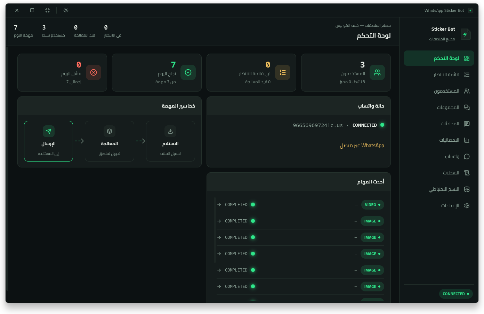</td>
    <td>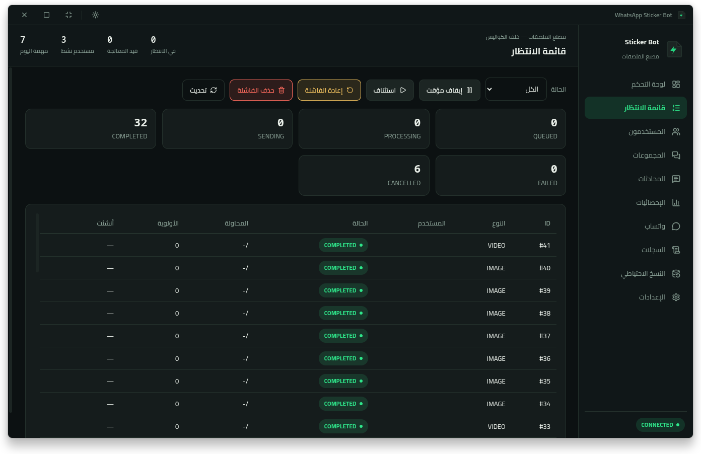</td>
  </tr>
  <tr>
    <td>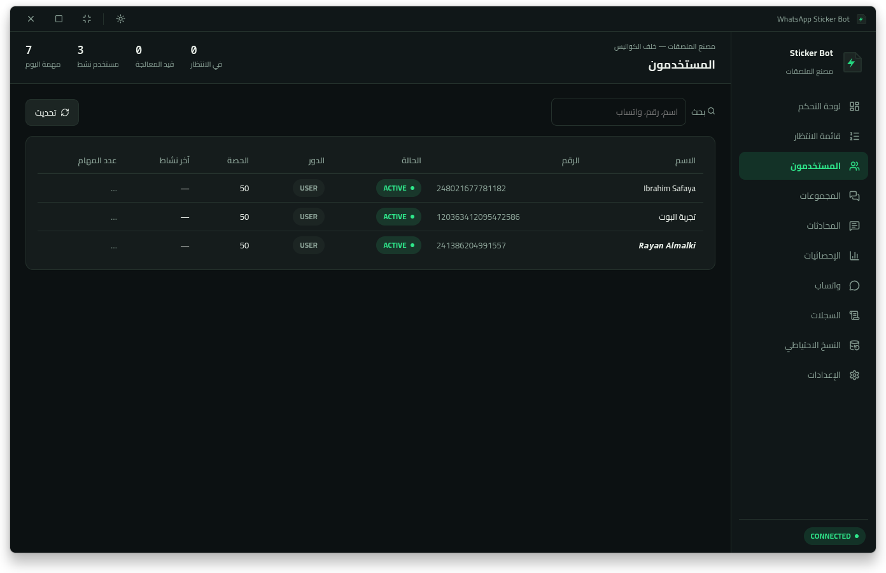</td>
    <td>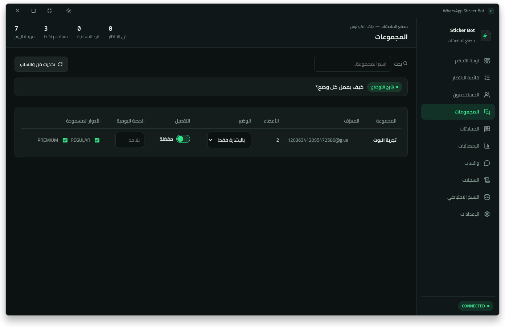</td>
  </tr>
  <tr>
    <td>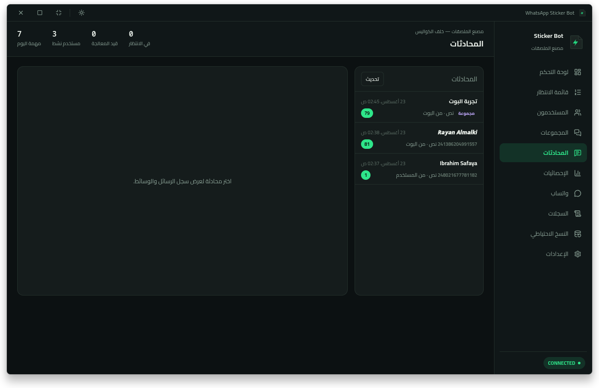</td>
    <td>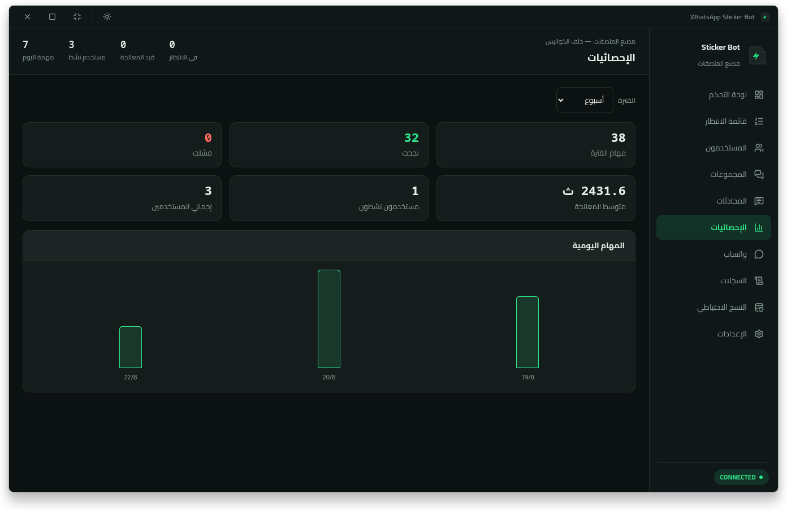</td>
  </tr>
  <tr>
    <td>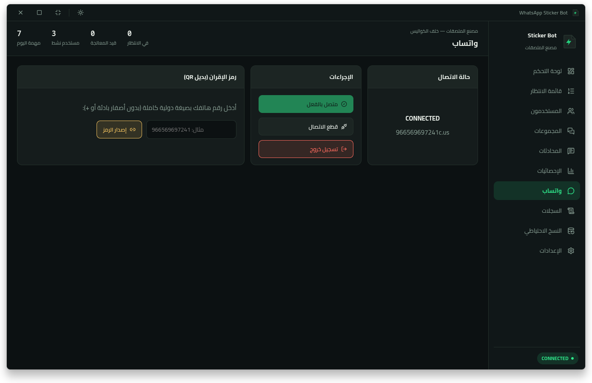</td>
    <td>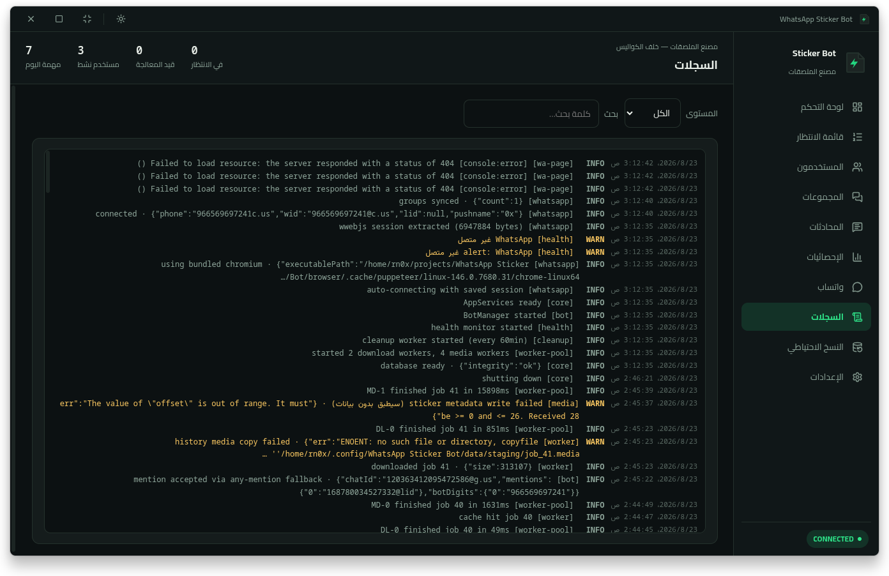</td>
  </tr>
  <tr>
    <td>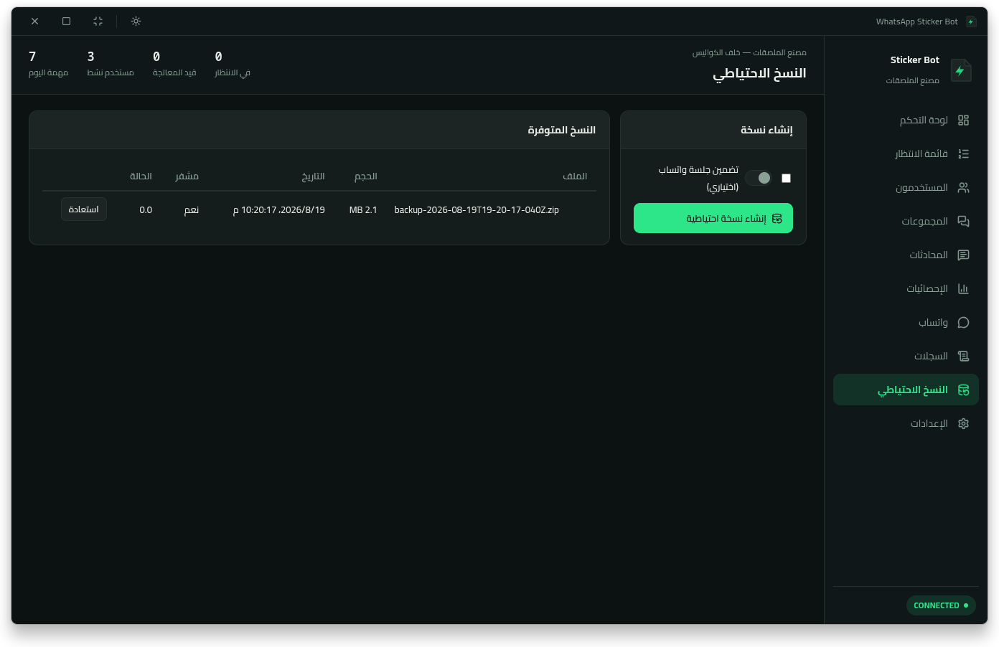</td>
    <td>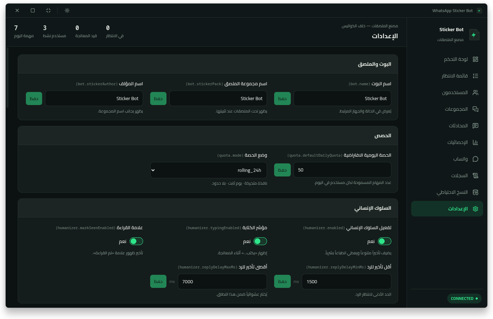</td>
  </tr>
  <tr>
    <td>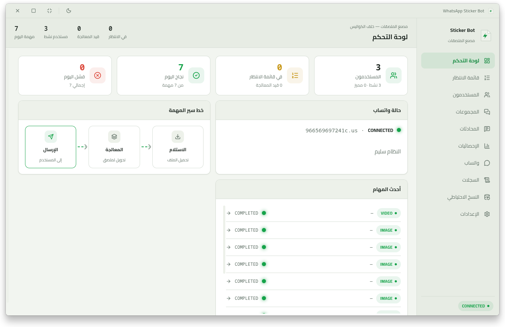</td>
    <td></td>
  </tr>
</table>

---

## الإعدادات (`.env`)

انسخ `.env.example` إلى `.env` وعدّل القيم (كلها اختيارية ولها افتراضيات):

| المفتاح | الوصف | الافتراضي |
| --- | --- | --- |
| `BOT_NAME` | اسم البوت المعروض | `Sticker Bot` |
| `STICKER_PACK` | اسم مجموعة الملصقات | `Sticker Bot` |
| `STICKER_AUTHOR` | اسم المؤلف | `Sticker Bot` |
| `GROUP_MODE` | وضع المجموعات الافتراضي | `auto` |
| `DEFAULT_DAILY_QUOTA` | الحصة اليومية | `50` |
| `QUOTA_MODE` | نمط الحصة | `rolling_24h` |
| `ADMIN_PASSWORD` | كلمة مرور لوحة التحكم | (تُضبط أول مرة) |

---

## البناء (إنتاج)

بعد `npm install` نفّذ سكربت البناء المناسب لمنصتك:

| السكربت | المخرج | المنصة |
| --- | --- | --- |
| `npm run pack:deb` | `.deb` | Linux (Debian/Ubuntu) |
| `npm run pack:rpm` | `.rpm` | Linux (Fedora/RHEL) |
| `npm run pack:flatpak` | `.flatpak` | Linux |
| `npm run pack:snap` | `.snap` | Linux |
| `npm run pack:appimage` | `.AppImage` | Linux (محمول) |
| `npm run pack:tar` | `.tar.gz` | Linux (أرشيف) |
| `npm run pack:win` | `.exe` (NSIS) | Windows |
| `npm run pack:win:portable` | `.exe` محمول | Windows |
| `npm run pack:mac` | `.dmg` | macOS |

المخرجات في مجلد **`release/`**. السكربتات تعتمد على `npm run build` الذي يبني واجهة العرض (Vite).

> ملاحظة: حزمتا `flatpak` و`snap` تُبنى ضمن بيئة معزولة (sandbox)؛ قد تحتاج صلاحيات إضافية بسبب متصفح Chromium المدمج. الحزم الأكثر موثوقية هي `AppImage` و`deb` و`rpm`.

---

## التنزيل من صفحة الإصدارات

كل الإصدارات الرسمية تُنشر تلقائياً في **GitHub Releases** عند وسم إصدار (مثل `v1.0.0`):

https://github.com/rn0x/whatsapp-sticker-bot/releases

تتوفر هناك حزم `deb` و`rpm` و`AppImage` و`flatpak` و`snap` و`tar.gz`، إضافة إلى مثبّت Windows.

---

## هيكل المشروع (مختصر)

```
src/
  main/         # نقطة دخول Electron + IPC + النوافذ
  bot/          # منطق البوت (BotManager، المعالجات، التقييد)
  whatsapp/     # محوّل wwebjs + متصفح Chromium
  media/        # محرك الوسائط (ffmpeg/sharp) والتحقق
  queue/        # خدمة الطابور ومجمّع المعالجات
  core/         # قاعدة البيانات والمستودعات والهجرات
  renderer/     # واجهة React (لوحة التحكم)
build/          # الأيقونات وموارد البناء
docs/           # الوثائق التفصيلية
scripts/        # أدوات (توليد الأيقونات، postinstall، إعداد المتصفح)
screenshot/     # لقطات شاشة التطبيق
```

---

## المساهمة

الإصدارات تُبنى عبر GitHub Actions عند كل وسم (`v*`). للتطوير المحلي اتبع خطوات "التثبيت من المصدر" و"التشغيل والتطوير"، وأرسل Pull Request بفرع واضح.

---

## الترخيص

هذا المشروع مرخّص تحت **MIT** — انظر ملف [LICENSE](./LICENSE).

---

## تنبيه قانوني

يعتمد البوت على مكتبة واتساب ويب غير رسمية، وهي لا تتوافق مع شروط خدمة WhatsApp. الاستخدام الكثيف قد يؤدي إلى **حظر الرقم/الحساب**. للاستخدام الرسمي والجماعي استخدم **WhatsApp Business Cloud API**. استخدم هذا التطبيق على مسؤوليتك الخاصة.
